<!--

author: Aina-Jula Stehr
email: stu223341@mail.uni-kiel.de
version: 0.1
language: de
narrator: Deutsch Female

-->

# Transkribus Workflow

")

## Wofür Transkribus nutzen?

Transkribus ist eine Software zur automatischen Texterkennung und Transkription von handschriftlichen und gedruckten Dokumenten. Sie ist Teil des EU-Projekts READ (Recognition and Enrichment of Archival Documents) und wurde entwickelt, um insbesondere historische Texte für die Forschung effizienter lesbar, transkriptierbar und digital zugänglich für die Öffentlichkeit zu machen. 

Zur automatischen Texterkennung verwendet Transkribus trainierte KI-Modelle, die auf spezifische Handschriften oder Schriftarten ausgerichtet sind und von Nutzern durch das Bereitstellen von fertigen, manuell korrigierten Transkripten als Trainingsdaten weiter verbessert werden können. Auch die Erstellung und das Trainieren eigener neuer Modelle ist möglich.

Neben der Texterkennung erkennt Transkribus zudem auch die Struktur von Dokumenten, wie z. B. Spalten, Seitenränder, Abbildungen, Seitenzahlen, Randnotizen und Fußnoten. 

Die transkribierten Texte können schließlich in verschiedenen Formaten exportiert werden, was ein flexibles Weiterarbeiten ermöglicht. 

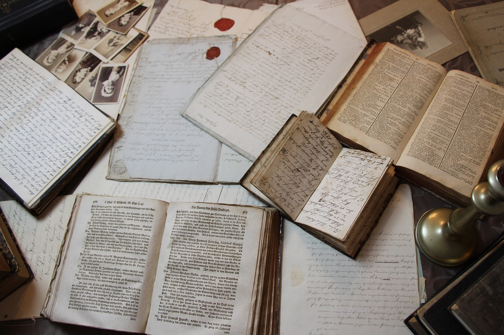

## Account erstellen

Besuchen Sie zunächst die Startseite von [Transkribus](https://www.transkribus.org/de).
 
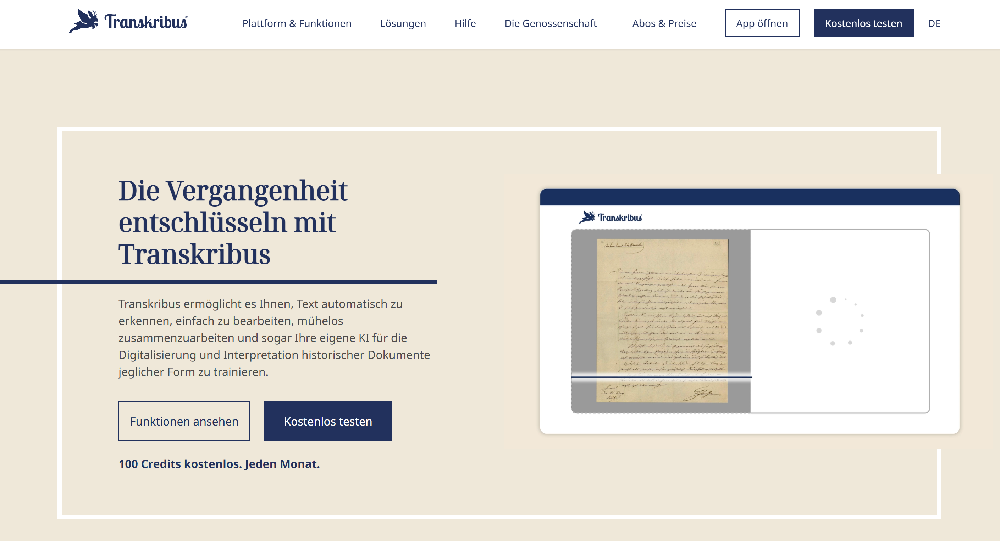

 
 
Hier können Sie bereits einen ersten Transkriptionsversuch starten...
 
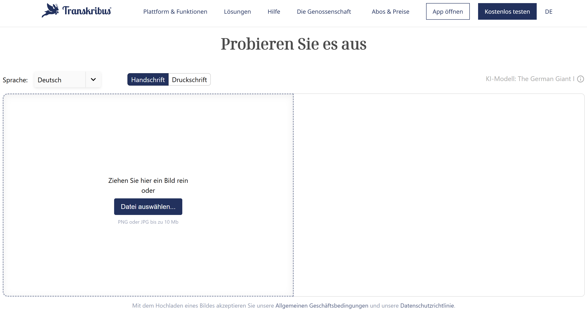

(Bitte die Datenschutzbestimmungen beachten!)
 
... und werden wahrscheinlich feststellen, dass einiges noch nicht korrekt erkannt oder wie gewünscht formatiert wurde. Dies kann bereits an der Auflösungsqualität des Dokuments liegen oder aber daran, dass das Transkriptions-Modell mit der Schrift nicht vertraut ist. Es wurde bei der Transkription automatisch ein öffentliches Modell (hier _The German Giant I_ ) verwendet. Als Nutzer:in von Transkribus ist es sowohl möglich, für jedes Dokument ein zu den Anforderungen (Sprache, Zeitraum, usw.) passendes Modell zu wählen, als auch eigene Modelle zu entwickeln. 

Dieser kurze Workshop soll zunächst nur in die Nutzung von Transkribus als reine Anwender:in einführen. Falls Interesse am trainieren von Modellen besteht, schauen Sie mal [hier](https://youtu.be/WroXUuLRa-E?feature=shared) rein.
Doch auch bei Verwendung bereits existierender KI-Modelle, lassen sich im Transkriptionseditor einige Einstellungen vornehmen, um das gewünschte Endergebnis zu erhalten... dazu später mehr :-)

>Zunächst benötigen Sie einen Account. Oben rechts in der Ecke finden Sie den Button _Kostenlos testen_ - nun sind es nurnoch wenige Eingaben bevor Sie loslegen können. 

## Die Benutzeroberfläche - Ein erster Überblick 

>Nach der Anmeldung erhalten Sie Zugriff auf die Benutzeroberfläche, wo Sie zwischen den drei Arbeitsbereichen _Workdesk_, _Models_ und _Sites_ navigieren können. 

>Dieses [You-Tube Tutorial von Transkribus](https://www.youtube.com/watch?v=lCdL_kKBMn8&list=PL7UbQtd4qlhIMP1KfdjGW3C-KXTxw4KYb&pp=iAQB) gibt in Kurzvideos einen ersten Überblick über die wichtigsten Funktionen. 
 
 

Workdesk:
--------
 

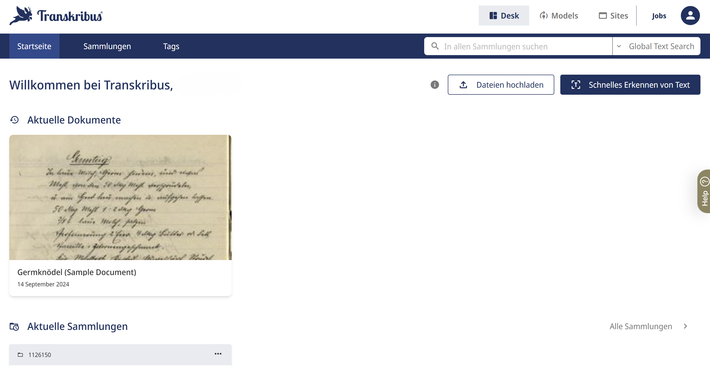

 
 

Models:
-------

Hier können Sie Ihre eignen und alle öffentlichen, vorgefertigten Modelle einsehen.

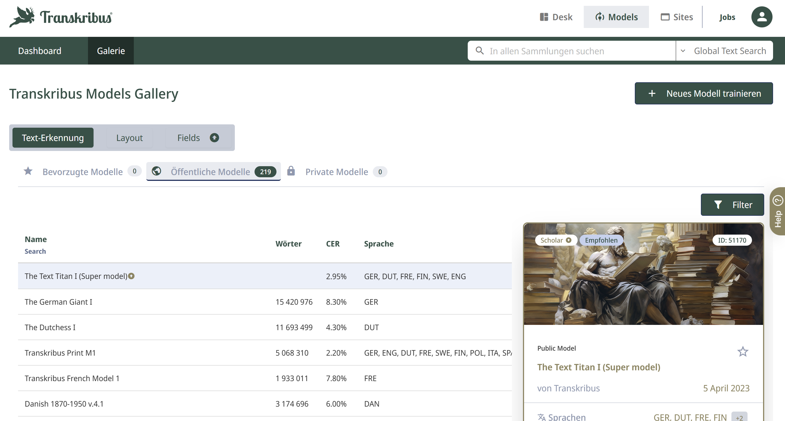

 
 

Sites:
-----

Sie haben hier die Möglichkeit, Ihre archivierten Transkriptionen direkt über Transkribus auf einer eigenen Website darzustellen.

### Hilfe

>Am rechten Bildschirmrand finden Sie in den meisten Ansichten einen Hilfebutton, mit dem Sie unter anderem in das [Help Center](https://help.transkribus.org/de) von Transkribus gelangen:

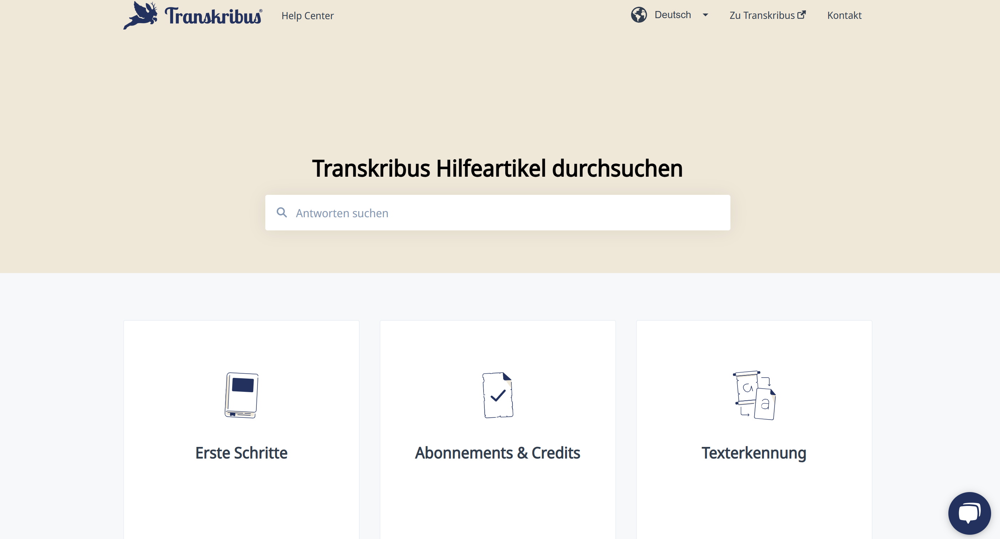

>Wenn sich auch hierdurch Ihr Problem nicht lösen lässt, können Sie unten rechts auf der Seite mit einem Chatbot ins Gespräch treten...

## Collection erstellen 

>In Transkribus organisieren Sie ihre Transkriptions-Projekte in sogenannten Sammlungen.
Ihre Sammlungen können Sie im Wordesk unter dem Navigationspunkt _Sammlungen_ einsehen. Klicken Sie zum Erstellen Ihrer ersten Sammlung auf den Button _+neue Sammlung_ oben rechts in der Ecke und wählen Sie einen prägnanten und passenden Namen für Ihre Sammlung aus.

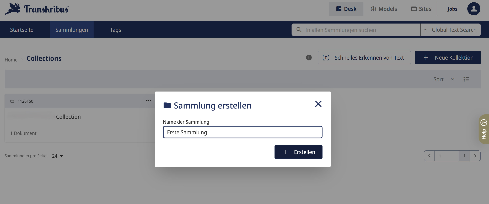

## Scannen mit ScanTent & Transkribus DocScan

>Für den Fall, dass Sie regelmäßig historische oder handschriftliche Dokumente scannen wollen, um sie später mit Transkribus zu transkribieren, oder ein Projekt von großem Seitenumfang umsetzen wollen, ist die Nutzung eines ScanTents in Kombination mit der DocScan-App eine Überlegung wert!

Die beiden Tools wurden entwickelt, um die Effizienz des Scanprozesses zu erhöhen und die Scanqualität zu verbessern. 

Bei dem ScanTent handelt es sich um eine speziell konzipierte mobile Scanstation. Die Halterung für das Smartphone ist über einem Zelt mit diffusem Licht angebracht, welches verbesserte Lichtverhältnisse bietet und so das Entstehen von Schatten und Überbelichtungen vermindert. Hierdurch kann vor allem der Transkriptionsprozess im Anschluss qualitativ verbessert werden. 

Mindestens genau so entscheidend ist darüber hinaus die Möglichkeit eines automatischen Auflösens: In Kombination mit der DocScan-App wird beim Umblättern zur nächsten Seite automatisch erkannt, wann ein neues Blatt gescannt werden soll und direkt ausgelöst. Die App kann zudem automatisch die Kanten der Dokumente erkennen und die Scans entsprechend zuschneiden. Anschließend lassen sich die Scans mithilfe von verschiedenen Korrektur-Tools zusätzlich noch manuell bearbeiten. Da DocScan und Transkribus kooperiern, wird anschließend das direkte und schnelle Integrieren von gescannten Dokumenten in ein Transkribus-Projekt ermöglicht, was den Workflow erheblich erleichtert. 

Also: Falls Sie Zugang zu einem ScanTent haben, lohnt sich ein Ausprobieren in jedem Fall! :-)

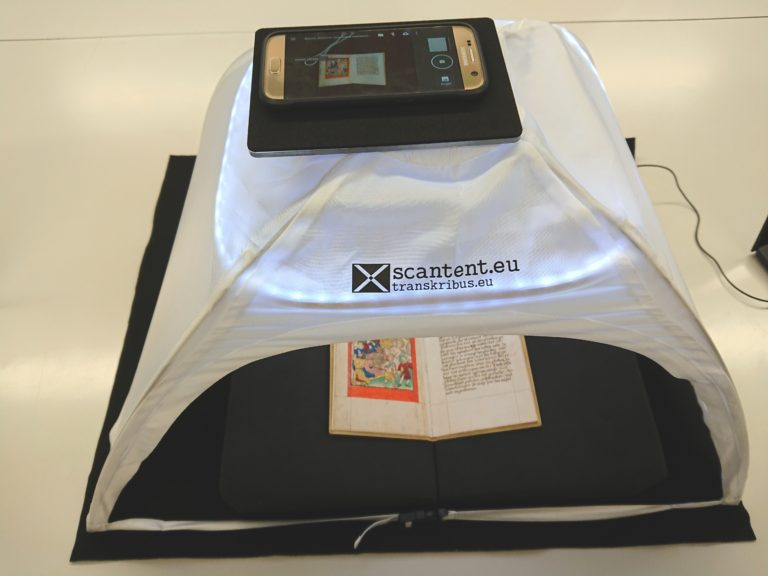

## Dokument hochladen

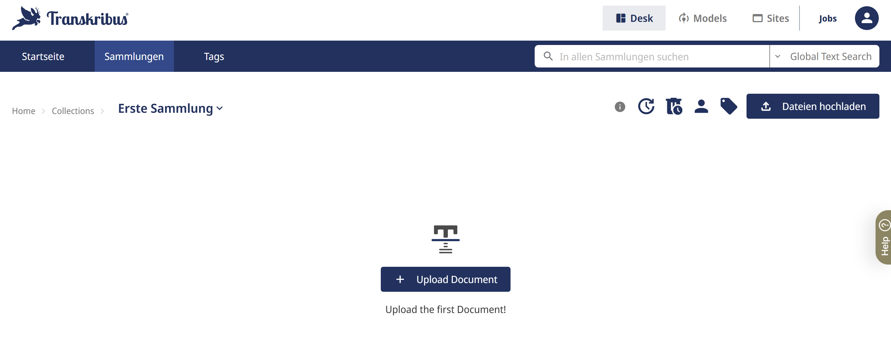

>In Ihrer Sammlung lässt sich nun das erste Dokument durch einen Klick auf _+Upload Document_ erstellen - für weitere Uploads nutzen Sie den Butten _Dateien hochladen_ oben rechts in der Ecke.
>Akzeptiert werden JPEG/JPG-, PNG- und PDF-Formate. Hier darauf achten, dass der richtige Dateityp gewählt wird!

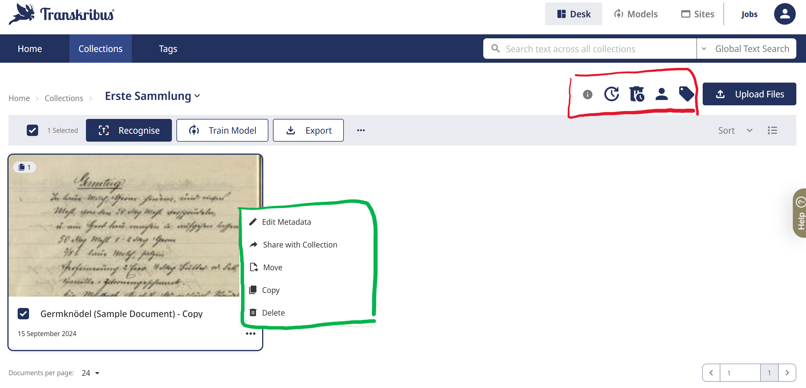

<!-- style="background-color: lightgreen;"-->
> Hier können Sie bereits hochgeladene Dokumente verwalten und mit Metadaten versehen.

<!-- style="background-color: pink;"-->
> **Kollaboratives Arbeiten:** Hier haben Sie unteren anderem die Möglichkeiten, das Versionsprotokoll einzusehen und andere User:innen als Projektparter:innen hinzuzufügen. Sie können selbst entscheiden, welche Rolle diesen zugewiesen wird auf diese Weise ein individuelles kollaboratives Arbeitsfeld gestalten.

## Organisation der einzelnen Seiten 

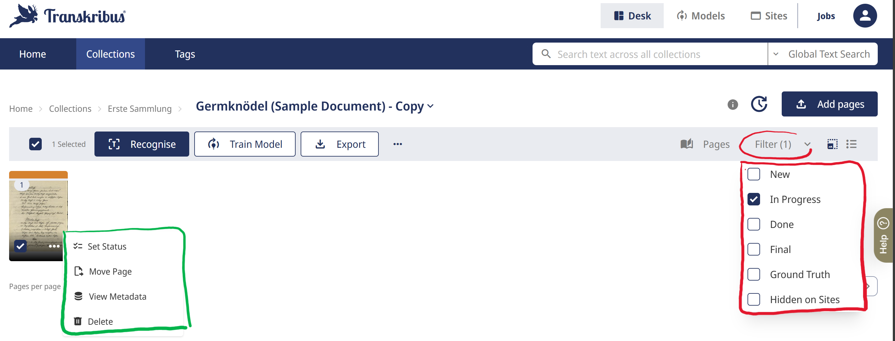

Hier können Sie...

<!-- style="background-color: lightgreen;"-->
> ... die einzelnen Seiten verwalten und

<!-- style="background-color: pink;"-->
> ... den einzelnen Seiten für eine erleichtere Organisation Ihres Projektes einen Bearbeitungsstatus zuordnen, welcher anschließend als farbliche Markierung angezeigt wird.

## Automatische Texterkennung starten

>Bevor Sie die Texterkennung starten, wollen Sie vielleicht zuvor einmal Ihre verbleibenden Credit-Points überprüfen. Nutzen Sie die kostenlose Version als Einzelperson, stehen Ihnen 100 Seiten (eine Seite pro Credit-Point) pro Monat zur Verfügung.

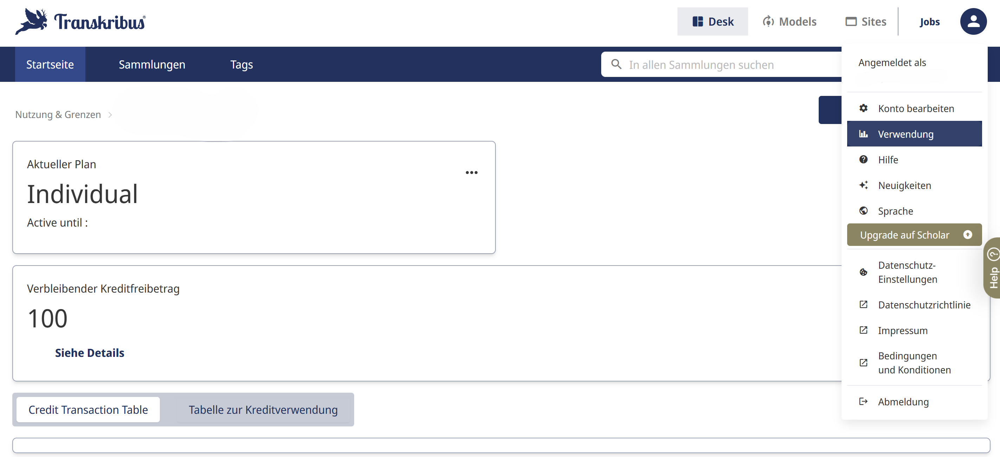

 
 

>Zu Anfang empfiehlt es sich, _The Text Titan I_ (erfordert Premium-Account) oder _The German Giant I_ für Handschriften und _Transkribus Print M1_ für Print zu verwenden.

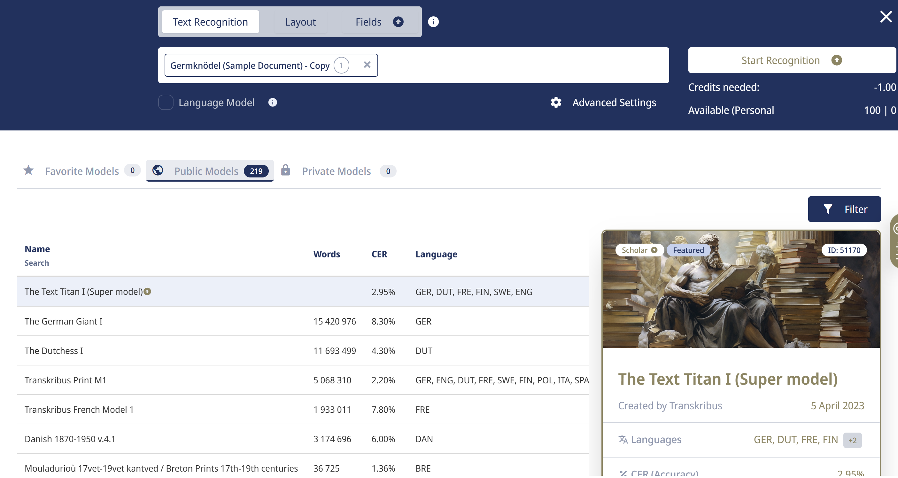

 
 

>Hinweis: Die Transkription kann einige Zeit in Anspruch nehmen. Einen Überblick über den Fortschritt kann man sich unter "Jobs" verschaffen.

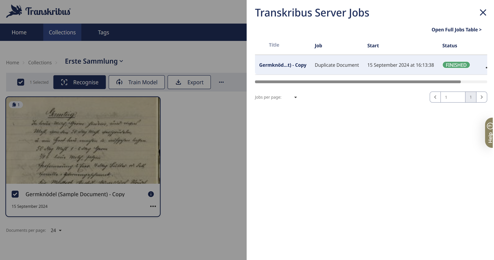

## Workflow für jede Seite

>**Das wichtigste zuerst:** Während der Transkriptionsarbeit bitte sehr regelmäßig an das Zwischenspeichern denken! 

Transkribus arbeitet größtenteils in einer Cloud und die Synchronisation kann manchmal verzögert oder unterbrochen sein. Nur durch manuelles Speichern lassen sich die Fortschritte sicher festhalten und neue Versionen erstellen, was auch die Rückkehr zu bestimmten Bearbeitungszuständen ermöglicht und somit besonders für kollaboratives Arbeiten sehr nützlich ist.

### Editor - Grundlegende Funktionen und Einstellungen

!?[Zoom, Einstellungen, Tags - Screencast](Videos/Zoom_Einstellungen_Tags_video_neu.mp4)

> Zur Strukturierung des transkriptierten Textes können Sie einzelne Wörter oder Sätze mit **Tags** versehen. Steht Ihnen in der Schnellauswahl kein passendes Label zur Verfügung, können Sie über die Einstellungen weitere Tag-Namen hinzufügen. Finden Sie auch dort keine passende Option, haben Sie die Möglichkeit, in Ihrer Sammlung individelle Tags zu kreieren.

!?[Versionsprotokoll - Screencast](Videos/Versionsprotokoll_weitere_Optionen_neu.mp4)

>**Bearbeitungsstatus einstellen:** Um den Überblick über Ihre Projekte zu behalten, haben Sie in der oberen Leiste die Möglichkeit, den Bearbeitungsstatus ihrer Seite auszuwählen. Dieser wird Ihnen anschließend im Workdesk für jedes Dokument und jede Seite angezeigt und erleichtert so die Organisation.

>**Versionskontrolle:** Frühere Versionen eines Dokuments können eingesehen und wiederhergestellt werden, falls eine Bearbeitung rückgängig gemacht werden muss.

>**Metadaten bearbeiten:** Unter _file information_ lassen sich die Metadaten des Dokuments bearbeiten, um zusätzliche Infomationen wie z.B. Titel, Erstellungsdatum und Urheber:in bereitzustellen.

>**Keyboard Shortcuts:** Es existieren eine Reihe an Shortcuts, die Ihnen die Transkriptionsarbeit erleichtern können. Wie im Video gezeigt steht Ihnen hierzu ein Dokument zur Übersicht zur Verfügung.

### Transkription und Layout überprüfen & anpassen

> Bei der automatischen Transkription lässt es sich unter Verwendung der aktuell verfügbaren Modellen kaum verhindern, dass zwischendurch auch **Erkennungsfehler** auftauchen. Diese können Sie dann manuell korrigieren. Auch eine fehlerhafte Zeilenerkennung lässt sich schnell beheben: Sie können zum einen per drag-and-drop die Anordnung der **Zeilen** beliebig verändern und zum anderen Zeilen löschen und hinzufügen. 
> Durch das Kreieren von **Regionen** unterstützen Sie die KI bei der strukturellen Erkennung des Dokuments. 
 

!?[Zeilen und Regionen - Screencast](Videos/lines_and_regions_video_neu.mp4)

### Image tags

> Um die semantische Struktur des Dokuments zu erhalten, lassen sich die einzelnen Regionen zudem durch das Hinzufügen von **Tags** klassifizieren.
 

!?[Image Tags - Screencast](Videos/image_tags_video_neu.mp4)

## Export der Ergebnisse

>Haben es alle Seiten aus Ihrem Dokument in den Status "Done" geschafft, so können Sie das gesamte Dokument exportieren. Die Exportoptionen variieren dabei je nach Dokument und User-Status. Die PDF-Option sollte allerdings immer zur Verfügung stehen. :-)

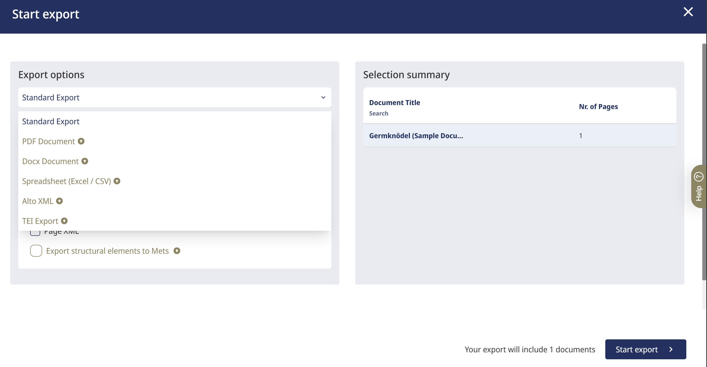

>Es ist auch möglich, im Erarbeitungsprozess bereits einzelne Seiten zu exportieren. Diese Option finden Sie, indem Sie im Editor oben rechts den Button mit den drei Punkten auswählen... achten Sie nur darauf, dass Ihnen keine ungespeicherten Änderungen mehr angezeigt werden!

## Mögliche Probleme bei der Arbeit mit Transkribus

**Wie können Sie die Texterkennung für historische Dokumente mit wechselnder Schreibrichtung verbessern?**

[[ ]] a) Durch Erhöhen der Scan-Auflösung
[[X]] b) Durch manuelle Anpassung der Layouterkennung
[[ ]] c) Durch Verwendung eines anderen Dateiformats
********

... via Konfiguration der Linien und Regionen

********

**Was sollten Sie tun, wenn Transkribus handschriftliche Abkürzungen und Zahlen nicht korrekt erkennt?**

[[ ]] a) Für die fehlerhaft erkannten Elemente eine eigene Region erstellen
[[ ]] b) Die Dokumente in ein anderes Format konvertieren
[[X]] c) Die Erkennungsergebnisse manuell überprüfen und korrigieren
******

Der Frakturdruck wird sehr zuverlässig erkannt, die Handschrift bzw. vor allem die Abkürzungen und Zahlen bereiten der Anwendung jedoch oft Probleme.

*******

>Antworten zu einigen in vorigen Seminaren aufgekommenen Problemen oder Fragen finden Sie [hier](https://liascript.github.io/course/?https://raw.githubusercontent.com/DH-Lehre/2024SoSe_Seminar-Frauengeschichte-Fruehe-Neuzeit/main/Projekt_Frauen.md#48).

